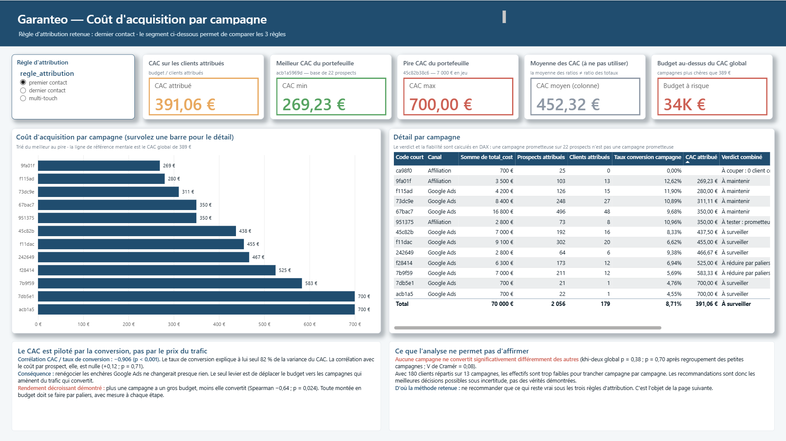
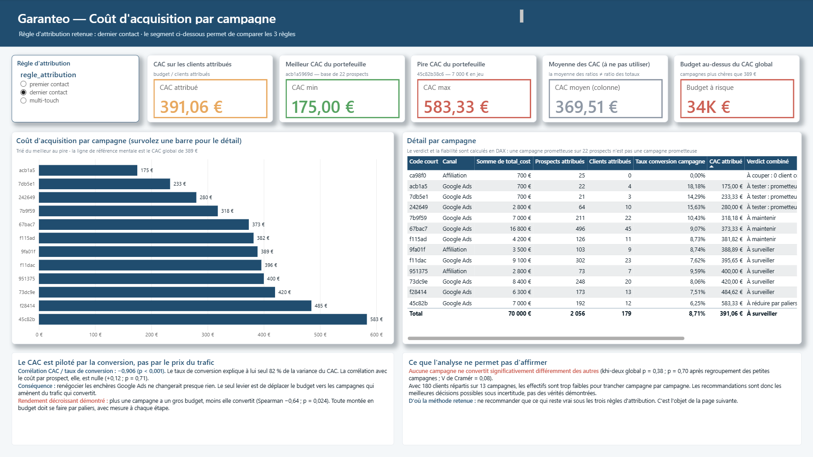
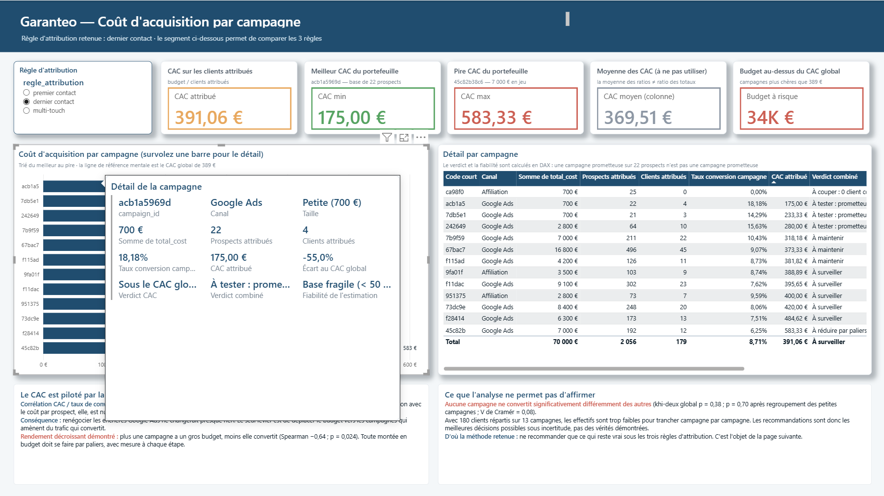

# Garanteo — Optimiser 70 000 € de budget d'acquisition digitale

Projet final de la formation Data Analyst **DataBird** (track DAFT), mené en solo.
Analyse complète d'un budget d'acquisition digitale : nettoyage, attribution multi-touch,
statistique inférentielle, dashboard Power BI et restitution orale.

**Le résultat en une phrase :** Garanteo croit payer 372 € pour acquérir un client, elle en paie
389 €, et son classement de campagnes s'inverse selon la règle d'attribution qu'on choisit.
Recommandation : redéployer 11 % du budget, à budget total inchangé.

---

## Le contexte

Garanteo est un assureur français fondé en 2015. Il dépense **70 000 € par an** en acquisition
digitale, répartis sur **13 campagnes** (Google Ads et affiliation), et prépare une révision
budgétaire.

La demande initiale du client : *« affiner sa stratégie d'acquisition digitale »*. Trop vague pour
être analysée telle quelle. La méthode des cinq pourquoi la ramène à un problème concret :

> **Garanteo ne peut pas comparer objectivement ses 13 campagnes entre elles.**

Trois sous-questions en découlent :

1. Combien coûte réellement l'acquisition d'un client, campagne par campagne ?
2. Le classement des campagnes dépend-il de la règle d'attribution retenue ?
3. Le pitch téléphonique fait-il baisser la conversion ?

## Les données

Quatre fichiers CSV fournis par le client, couvrant l'année 2023 complète, soit environ
**1,78 million de points de données**.

| Table | Lignes brutes | Après nettoyage | Contenu |
|---|---|---|---|
| `prospects` | 2 160 | 2 060 | Les personnes identifiées, dont 180 clients |
| `sessions` | 23 823 | 22 973 | Les visites sur le site |
| `events` | 101 450 | 90 436 | Les clics, dont les demandes de rappel |
| `campaigns` | 13 | 13 | Le budget de chaque campagne |

**11 964 lignes supprimées, soit 9,4 %**, et une seule d'entre elles a demandé un arbitrage :
les 100 identifiants de prospects en double. Les 850 doublons de sessions étaient stricts
(identiques sur toutes les colonnes) et les 11 014 events supprimés n'avaient ni identifiant
utilisateur, ni horodatage, ni identifiant de session.

Règle de conduite tenue tout au long du projet : **ne modifier que ce qui peut être justifié**.
Deux colonnes vides à 38 % ont été laissées telles quelles plutôt que remplies par la valeur la
plus fréquente, ce qui aurait revenu à affirmer une information inconnue.

## Ce que l'analyse a trouvé

### 1. Le coût d'acquisition réel est 4,4 % plus élevé qu'affiché

Parmi les 100 identifiants en double, **huit étaient des clients comptés deux fois**. Le fichier
brut affichait donc 188 clients au lieu de 180.

| | Avant dédoublonnage | Après |
|---|---|---|
| Clients | 188 | **180** |
| Coût d'acquisition | 372 € | **389 €** |

Un écart de 4,4 % obtenu sans toucher au budget, uniquement en corrigant le dénominateur.
C'est sur ces chiffres faux que Garanteo arbitrait.

### 2. Le lien dépense → client n'existe pas dans les données

Les demandes de rappel, qui sont les conversions, portent **toutes** un identifiant de campagne
vide, sans exception. Impossible de savoir directement quelle campagne a converti un prospect.

Le lien doit être reconstruit : on repart de la personne devenue cliente, on retrouve ses clics
précédents qui, eux, portent une campagne, on les trie par date, et on en choisit un selon une
règle d'attribution. Trois règles ont été calculées :

| Règle | Ce qu'elle garde | À quelle question elle répond |
|---|---|---|
| Premier contact | La plus ancienne touche | Qui a fait *découvrir* Garanteo ? |
| **Dernier contact** *(retenue)* | La plus récente avant conversion | Qui a fait *basculer* le prospect ? |
| Multi-touch | Toutes | Lesquelles ont *participé* ? |

Le choix n'est pas anodin : **91 % des prospects ont vu plusieurs campagnes avant de convertir**,
3,9 en moyenne et jusqu'à 7.

### 3. Changer de règle retourne le classement

C'est la conclusion méthodologique centrale du projet. Mêmes personnes, mêmes données, même
code : seule la colonne qu'on regarde change.

| Campagne | Premier contact | Dernier contact |
|---|---|---|
| `acb1a5969d` | 700 € · **dernière du portefeuille** | 175 € · **première** |
| `9fa01fb1a0` | 269 € · première | 389 € · 7ᵉ |
| `45c82b38c6` | 438 € | 583 € · dernière |

Voici les deux mêmes écrans du dashboard, à un clic d'intervalle. Seul le segment
**règle d'attribution**, en haut à gauche, a changé.

`acb1a5969d` passe de la dernière à la première place, son coût par client tombe de 700 € à 175 €,
et la carte orange n'a pas bougé : ni le budget, ni le nombre de clients n'ont changé. Seul le
mérite qu'on leur attribue a changé de destinataire.

Deux analystes travaillant sur les mêmes données peuvent donc recommander de couper des campagnes
opposées, et tous les deux avoir raison. **La première recommandation n'est pas un nom de
campagne, c'est d'acter une règle.**

### 4. Le coût d'acquisition est piloté par la conversion, pas par le prix du clic

| Relation testée | Coefficient | p-value | Verdict |
|---|---|---|---|
| CAC ~ taux de conversion | Pearson **−0,906** | < 0,001 | Significatif : explique 82 % de la variance |
| CAC ~ coût par prospect | Pearson +0,12 | 0,71 | Non significatif |
| Budget ~ taux de conversion | Spearman **−0,64** | 0,024 | Rendement décroissant démontré |

Conséquence opérationnelle : renégocier les enchères Google Ads ne changerait presque rien. Le
seul levier est de déplacer le budget vers les campagnes qui convertissent. Et comme le rendement
est décroissant, toute réallocation doit se faire **par paliers avec mesure à chaque étape**.

### 5. Le pitch téléphonique : un écart non démontré

Quatre tests indépendants (khi-deux, test t de Welch, test exact de Fisher, test de proportions)
donnent des p-values comprises entre **0,073 et 0,103**, donc toutes au-dessus du seuil de 5 %.
L'écart observé reste compatible avec le hasard de l'échantillon.

Il est documenté comme **une piste à tester, pas comme un résultat**. À noter au passage :
**68 % des prospects ne sont jamais joints au téléphone**, ce qui est probablement un levier plus
important que le contenu du pitch lui-même.

## Les recommandations

À **budget total inchangé** : les 70 000 € ne bougent pas, seule leur répartition change.

| # | Recommandation | Montant | Fondement |
|---|---|---|---|
| 1 | Acter une règle d'attribution | — | Sans elle, aucun classement n'est opposable |
| 2 | Couper `ca98f07be2` | 700 € | 0 client sur 25 prospects, dernière sous les 3 règles |
| 3 | Réduire `45c82b38c6` par paliers | 7 000 € | CAC de 583 €, soit 50 % au-dessus de la moyenne |
| 4 | Tester la montée de `9fa01fb1a0` | — | Meilleur rang moyen avec un volume crédible |
| 5 | Test A/B sur le pitch, après la joignabilité | — | Écart non significatif, à instrumenter |

**Chiffrage :** 7 700 € redéployés, soit 11 % du budget. Au coût d'acquisition de référence de
359 €, cela représente **+9,5 clients** et fait passer le CAC global de 389 € à 369 €, sans
dépenser un euro de plus.

## Ce que l'analyse ne permet PAS d'affirmer

Cette section fait partie du livrable, elle n'est pas un aveu de faiblesse.

- **Aucune campagne ne convertit significativement différemment des autres** (khi-deux global
  p = 0,38 ; V de Cramér = 0,08). Avec 180 clients répartis sur 13 campagnes, les effectifs sont
  trop faibles pour trancher campagne par campagne.
- Les recommandations sont donc **les meilleures décisions possibles sous incertitude**, pas des
  vérités démontrées. C'est précisément pourquoi elles ne retiennent que ce qui reste vrai sous
  les trois règles d'attribution.
- Le chiffrage suppose que les campagnes recevant le budget tiennent leur CAC à volume plus élevé.
  Or la corrélation budget/conversion dit l'inverse : le gain réel sera inférieur à 9,5 clients.
- Le coût par clic est **reconstitué** (budget ÷ nombre de clics), il n'est pas fourni.
- La durée de session est plafonnée à 60,0 minutes par l'outil de collecte : les sessions plus
  longues sont invisibles.

## Le dashboard Power BI

Sept pages, une par question, plus une page d'infobulle affichée au survol d'une campagne.
Modèle en étoile de 13 tables, 8 relations, 49 mesures DAX et 22 colonnes calculées.

| Page | Contenu |
|---|---|
| 1 · Vue d'ensemble | L'entonnoir de conversion et les indicateurs de cadrage |
| 2 · Coût d'acquisition | Le CAC par campagne, avec verdict et fiabilité calculés en DAX |
| 3 · Règle d'attribution | Le même budget vu sous les trois règles |
| 4 · Pitch | Les quatre tests statistiques et leur lecture |
| 5 · Scénario budgétaire | La réallocation recalculée en direct |
| 6 · Suivi mensuel | L'évolution sur l'année et les cumuls |
| 7 · Qualité des données | Les anomalies et ce qu'elles faussaient |

Un segment **règle d'attribution** recalcule l'ensemble du rapport : c'est ce qui transforme le
constat de la conclusion n° 3 en outil de décision.

Au survol d'une campagne, une page d'infobulle affiche son détail complet :

## Contenu du dépôt

Ce dépôt contient les **trois livrables** du projet, ceux remis pour la soutenance.

| Fichier | Ce que c'est |
|---|---|
| `02_Notebooks/main.ipynb` | Le notebook complet : 263 cellules, du nettoyage aux tests statistiques, **avec toutes les sorties et les graphiques** |
| `04_Dashboard/Garanteo_Sophie_Paradon.pbix` | Le rapport Power BI : 7 pages plus une infobulle, 13 tables, 49 mesures DAX |
| `05_Restitution/Garanteo_Restitution.pptx` | La présentation : 26 slides de soutenance et 4 annexes |
| [`05_Restitution/Garanteo_Restitution.pdf`](05_Restitution/Garanteo_Restitution.pdf) | **La même présentation en PDF, consultable directement ici**, sans rien installer |

Les fichiers de données et les documents de travail intermédiaires ne sont pas publiés. Le
notebook affichant l'intégralité de ses sorties, **chaque chiffre de cette page est vérifiable en
l'ouvrant**.

## Consulter les livrables

**Le notebook** s'affiche directement dans GitHub : clique sur `02_Notebooks/main.ipynb`. Les
tableaux, les graphiques et les résultats des tests statistiques sont rendus tels quels, sans rien
installer. Il se termine par 9 contrôles automatiques de cohérence qui affichent `ECART` si un
chiffre clé a bougé.

**Le rapport Power BI** s'ouvre avec Power BI Desktop, gratuit. Les données sont embarquées dans
le fichier : il s'affiche tel quel, sans source externe. Une seule précaution, ne pas cliquer sur
*Actualiser* — le modèle chercherait alors les CSV d'origine, qui ne sont pas publiés ici.

**La présentation** est disponible en deux formats. Le
[PDF](05_Restitution/Garanteo_Restitution.pdf) s'affiche page par page dans GitHub, sans rien
installer : c'est le plus simple pour la parcourir. Le `.pptx` est le fichier d'origine, à
télécharger. Elle suit le fil cadrage, préparation, analyse, restitution, recommandations, et les
quatre annexes répondent aux questions de détail.

## Outils

`Python` · `pandas` · `scipy.stats` · `matplotlib` · `seaborn` · `Jupyter / Google Colab` ·
`Power BI Desktop` · `DAX` · `Power Query (M)`

**Méthodes statistiques :** corrélations de Pearson et de Spearman, test du khi-deux avec V de
Cramér, test t de Welch, test exact de Fisher, test de proportions, intervalles de confiance de
Wilson, méthode de l'écart interquartile.

---

*Sophie Paradon — Formation Data Analyst DataBird, promotion 2026.
Les données de ce projet sont fictives et fournies dans un cadre pédagogique.*
